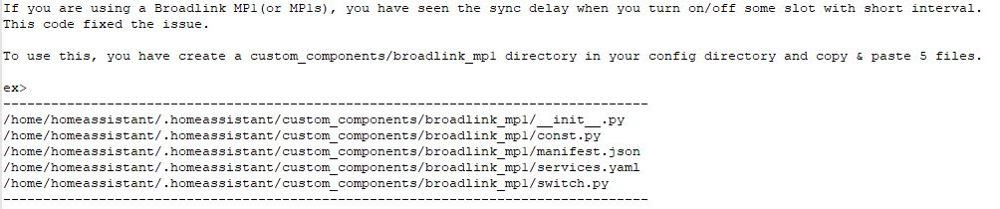
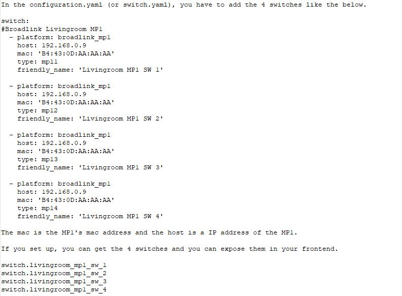

# Home-Assistant-Broadlink-MP1-Custom-Component (Above HA Version 0.94.0)
There is a sync delay in official component for Broadlink MP1 of HA. This code resolved the issue! (Tested in HA version 0.94.0)

<latest update>
June 19th, 2019 : Fixed the long booting time issue at hass.io

